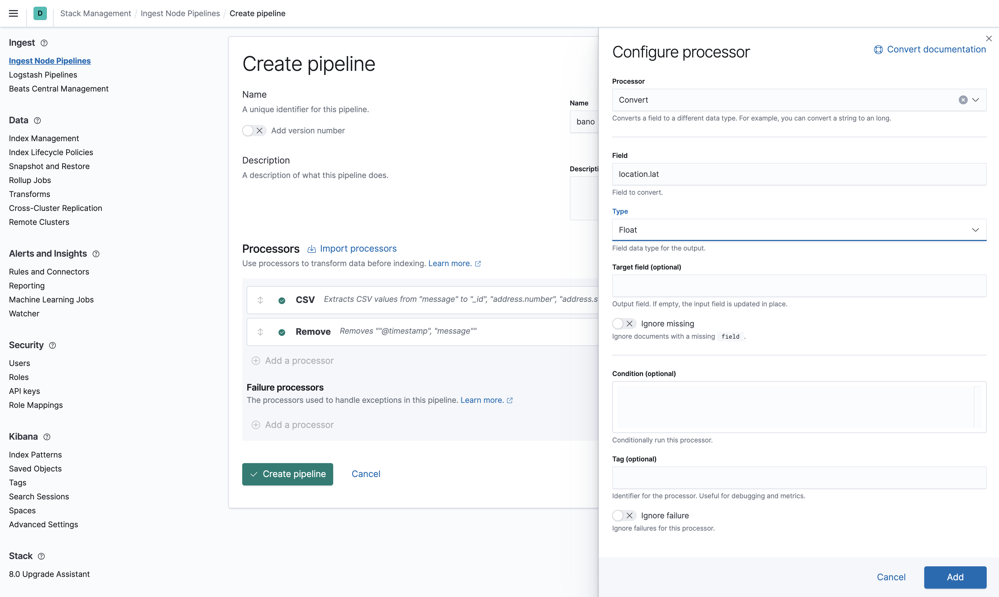

# Demo scripts used for S02E11 - Elastic Daily Bytes - Kibana Ingest Pipeline Management


## Setup

The setup will check that Elasticsearch and Kibana are running.
It will remove any index named `demo_csv*`.

It will also add Kibana Canvas slides.

### Run on cloud (recommended)

This specific configuration is used to run the demo on a [cloud instance](https://cloud.elastic.co).
You need to create a `.cloud` local file which contains:

```
CLOUD_ID=the_cloud_id_you_can_read_from_cloud_console
CLOUD_PASSWORD=the_generated_elastic_password
```

Run:

```sh
./setup.sh
```

### Run Locally

Run Elastic Stack:

```sh
docker-compose down -v
docker-compose up
```

And run:

```sh
./setup.sh
```

## Kibana Ingest Management

Node Ingest Pipelines allows to transform on the fly documents to another data structure.

## Demo part

### Dataset

Open the Dev Console and run a simple search to show what the data looks like:

```json
GET /demo_csv/_search
```

A document describes a postal address in France. It looks like this:

```json
{
  "@timestamp" : "2021-06-18T18:50:53",
  "message" : "950020004L-1,1,Rue du Clos Saint-Martin,95450,Ableiges,OSM,49.06789,1.969323"
}
```

Which is pretty much unuseful.

We should instead index our documents using the following format:

```json
{
  "location": {
    "lon": 1.969323,
    "lat": 49.06789
  },
  "address": {
    "zipcode": "95450",
    "number": "1",
    "city": "Ableiges",
    "street_name": "Rue du Clos Saint-Martin"
  },
  "source": "OSM"
}
```

And we could also use the first column as the `_id`: `950020004L-1`.


### Create an empty pipeline


### Add the CSV Processor

* "field": `message`
* "target_fields": 
  * `_id`
  * `address.number`
  * `address.street_name`
  * `address.zipcode`
  * `address.city`
  * `source`
  * `location.lat`
  * `location.lon`


### Test some of the documents

Take some random documents:

```json
GET /demo_csv/_search
{
  "query": {
    "function_score": {
      "random_score": {}
    }
  }
}
```

Copy paste the array of hits:

```json
[
  {
    "_index" : "demo_csv",
    "_type" : "_doc",
    "_id" : "Vb4IIHoBgxQVs4WbvcxH",
    "_score" : 0.99985677,
    "_source" : {
      "@timestamp" : "2021-06-18T18:50:58",
      "message" : "950140640A-6,6,Rue des Prés,95580,Andilly,C+O,48.999518,2.299499"
    }
  },
  {
    "_index" : "demo_csv",
    "_type" : "_doc",
    "_id" : "2L4IIHoBgxQVs4WbveJN",
    "_score" : 0.9998263,
    "_source" : {
      "@timestamp" : "2021-06-18T18:51:14",
      "message" : "950181940W-14,14,Rue d'Épinay,95100,Argenteuil,C+O,48.948652,2.26231"
    }
  },
  {
    "_index" : "demo_csv",
    "_type" : "_doc",
    "_id" : "T74IIHoBgxQVs4WbvdZK",
    "_score" : 0.9994188,
    "_source" : {
      "@timestamp" : "2021-06-18T18:51:05",
      "message" : "950180965L-13,13,Place des Canuts,95100,Argenteuil,C+O,48.953994,2.225211"
    }
  },
  {
    "_index" : "demo_csv",
    "_type" : "_doc",
    "_id" : "Y74IIHoBgxQVs4WbveJN",
    "_score" : 0.9993211,
    "_source" : {
      "@timestamp" : "2021-06-18T18:51:13",
      "message" : "950181920Z-332,332,Route d'Enghien,95100,Argenteuil,C+O,48.957179,2.286887"
    }
  },
  {
    "_index" : "demo_csv",
    "_type" : "_doc",
    "_id" : "o74IIHoBgxQVs4WbvcxH",
    "_score" : 0.9993076,
    "_source" : {
      "@timestamp" : "2021-06-18T18:50:58",
      "message" : "950140793S-16,16,Allée du Val Fleuri,95580,Andilly,C+O,48.997968,2.299783"
    }
  },
  {
    "_index" : "demo_csv",
    "_type" : "_doc",
    "_id" : "GL4IIHoBgxQVs4Wbvd1M",
    "_score" : 0.9992925,
    "_source" : {
      "@timestamp" : "2021-06-18T18:51:10",
      "message" : "950181470K-37,37,Rue du Coq,95100,Argenteuil,C+O,48.95634,2.239543"
    }
  },
  {
    "_index" : "demo_csv",
    "_type" : "_doc",
    "_id" : "_r4IIHoBgxQVs4WbvdtL",
    "_score" : 0.99928904,
    "_source" : {
      "@timestamp" : "2021-06-18T18:51:09",
      "message" : "950181390Y-55,55,Rue Claude Monet,95100,Argenteuil,C+O,48.948625,2.269745"
    }
  },
  {
    "_index" : "demo_csv",
    "_type" : "_doc",
    "_id" : "7L4IIHoBgxQVs4WbvddK",
    "_score" : 0.9992085,
    "_source" : {
      "@timestamp" : "2021-06-18T18:51:06",
      "message" : "950181110U-72,72,Rue de Chailloit,95100,Argenteuil,C+O,48.962728,2.23846"
    }
  },
  {
    "_index" : "demo_csv",
    "_type" : "_doc",
    "_id" : "zb4IIHoBgxQVs4WbvdJJ",
    "_score" : 0.99907935,
    "_source" : {
      "@timestamp" : "2021-06-18T18:51:03",
      "message" : "950180605V-2,2,Allée Beethoven,95100,Argenteuil,C+O,48.954052,2.219405"
    }
  },
  {
    "_index" : "demo_csv",
    "_type" : "_doc",
    "_id" : "Ir4IIHoBgxQVs4WbvclG",
    "_score" : 0.9985456,
    "_source" : {
      "@timestamp" : "2021-06-18T18:50:56",
      "message" : "950110040L-6,6,Sentier des Taillis,95710,Ambleville,CAD,49.145115,1.693449"
    }
  }
]
```


And run the pipeline.


It looks good, right?


### Add Remove Processor

Actually, no. Let's remove non needed fields: `@timestamp` and `message`.


If you click on "View Output", you will get the new version of the documents.


### Add Convert lat/lon to float

Add a Convert processor:

# "field": "location.lat",
# "type": "float"




You can use the duplicate menu to add the next Convert processor:

# "field": "location.lon",
# "type": "float"


### Verbose option

The verbose option is helpful to debug the pipeline and watch each step.


### Show Request

If you click on Show Request, you can see the whole detail of the API call which is going to happen behind the scene.


### Create the pipeline

Once you have created the pipeline, you can manage it.


### Dealing with errors

Let's have some documents with errors from the source

```json
{
  "_index" : "demo_csv",
  "_type" : "_doc",
  "_id" : "Zr4IIHoBgxQVs4WbvetQ",
  "_score" : 0.99995965,
  "_source" : {
    "@timestamp" : "2021-06-18T18:51:20",
      "message": "950182380Z-10,10 Rue des Glaieuls 95100 Argenteuil"
  }
}
```


We can add ignore the missing field. 


It helps to move to the next step where we can also add the ignore processor.


The final result is actually not that good.


```
"number": "10 Rue des Glaieuls 95100 Argenteuil"
```

We should not ignore missing fields but ignore when the processor is failing.


We can also remove the `address` field if any.


You can see the final result:


### Let's try it in action

You can then use the pipeline anywhere you want like with the reindex API:

```json
POST /_reindex?wait_for_completion=true
{
  "source": {
    "index": "demo_csv"
  },
  "dest": {
    "index": "demo_csv_bano",
    "pipeline": "bano"
  }
}
```

Check it worked:

```json
GET /demo_csv_bano/_search
```
